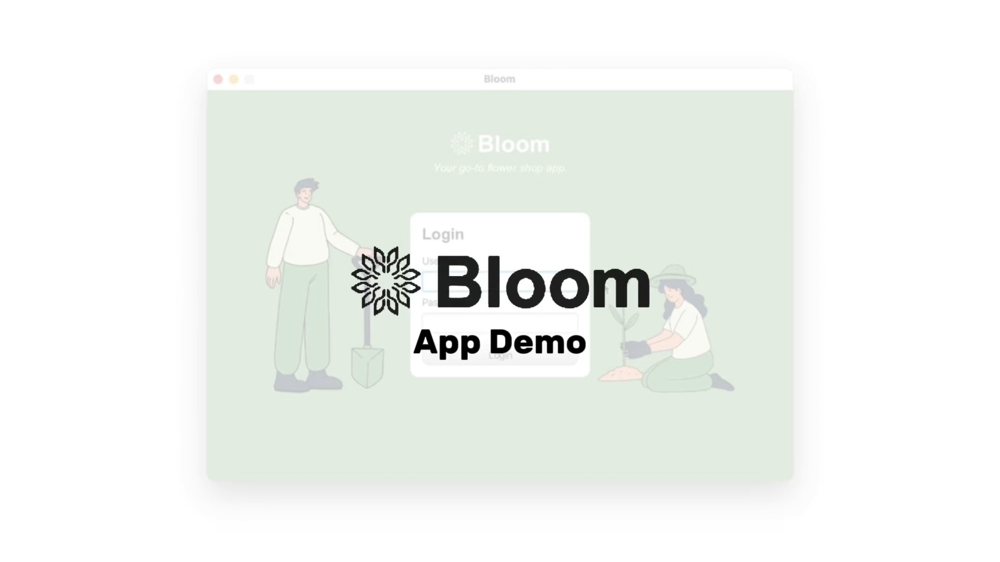
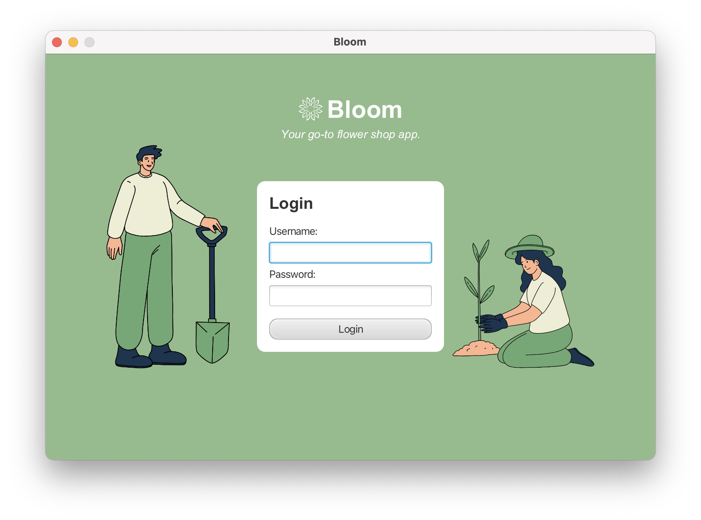
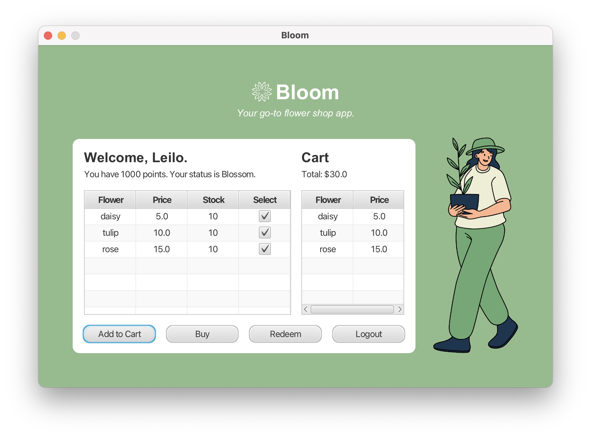
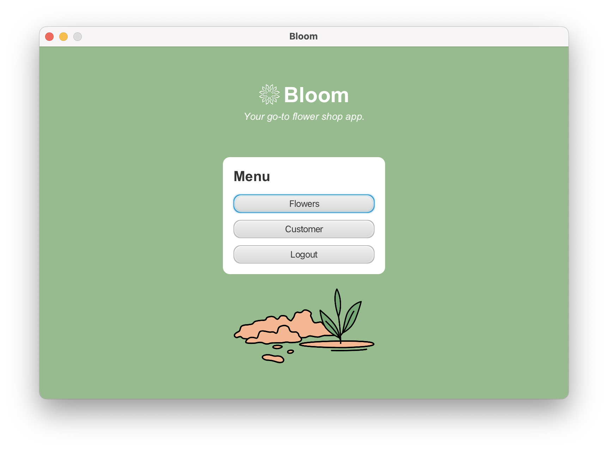
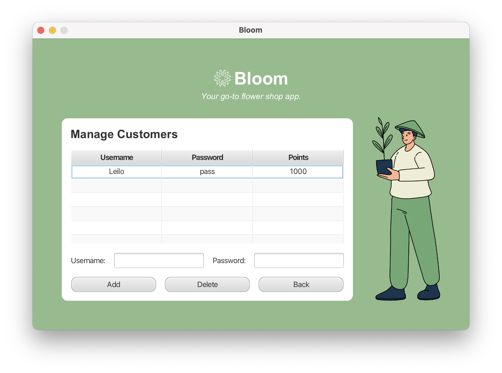
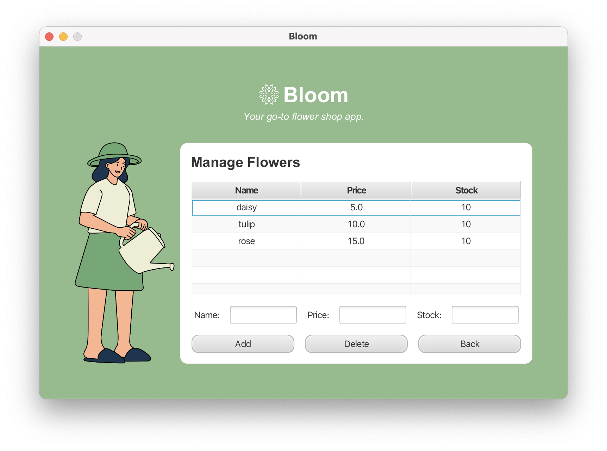

# 🌸 Flower Store Management System

A **JavaFX-based desktop application** designed for managing a flower store with clear separation of **UI**, **business logic**, and **data handling**.  

Supports **role-based login** for staff and customers, dynamic **reward status updates** using the **State Design Pattern**, and persistent storage through **file I/O**.  

---

## ▶️ Demo

➡️ [Click here to watch the demo](https://youtu.be/tlcOhIObEFg)

---

## 🖼️ Screenshots

### 🏠 Login Page

### 🌼 Customer Dashboard

### 🧑‍💼 Staff Dashboard

### 🌸 Customer Management

### 🌸 Inventory Management

---

## ⚙️ Features

- **Role-Based Login**  
  - **Staff**: Manage inventory and customer accounts.  
  - **Customers**: Browse flowers, purchase, earn, and redeem points.

- **State Design Pattern**  
  - Dynamically updates customer reward status (**Silver** or **Gold**) based on accumulated points.

- **Persistent Storage**  
  - All customer and flower data are stored using **file I/O**, ensuring consistent data even after app restarts.

- **Inventory Management**  
  - Staff can add, remove, or update flower items easily.

- **Reward System**  
  - Customers earn points equal to `100 × flower price`, which can be redeemed on future purchases.

---

## 🧠 Technologies Used

- **Java**
- **JavaFX**
- **State Design Pattern**
- **File I/O (Text-based persistence)**
